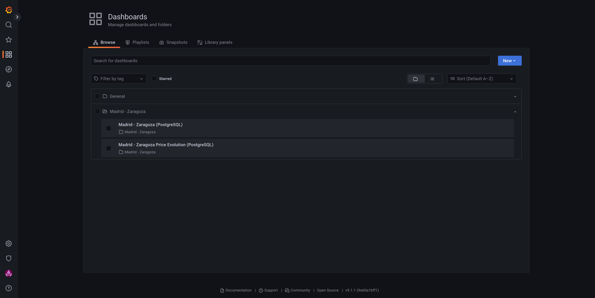

# AVE *(RENFE)* Round Trip

This project tries to solve a not-so-common problem:

*Find the cheapest round trip between two cities on AVE (RENFE) line and get notifications when prices change.*

People are not aware of price changes on AVE *(RENFE)* service. 
Furthermore, they used to think that the price were always the same.

## My personal use case

I go to Zaragoza *(from Madrid)* sometimes per month. I go to Zaragoza early in the morning, and I return to Madrid on the same day. 
So I need a way to find the cheapest round trip between Zaragoza and Madrid.

## TL;DR

To make the project run out of the box *(locally)*:

- Modify the `.pg.env` file by adding your telegram bot token and your telegram chat id.

```bash
export TRAVEL_NOTIFICATION_TOKEN=<TO_BE_DEFINED>
export TRAVEL_NOTIFICATION_CHAT_ID=<TO_BE_DEFINED>
```

- Then:

```bash
$ docker-compose up -d
# or
$ docker compose up -d
```

Wait a few seconds/minutes, then open your browser and access to [http://localhost:3000/](http://localhost:3000/).
Log in with the following credentials:

- Username: `ave`
- Password: `could-be-less-expensive`





## Develop

You will require `python` along with `pip` and `virtualenv`.

```bash
$ virtualenv -p python3 venv
$ source venv/bin/activate
$ pip install --upgrade pip
$ pip install -r requirements-dev.txt
```

For a smooth experience, use `docker` and `docker compose` to run this project locally.

### OS Database dependencies

If you have an error while installing the python dependencies locally:

```bash
$ pip install -r requirements-dev.txt 
Collecting selenium==4.4.0
  Using cached selenium-4.4.0-py3-none-any.whl (985 kB)
Collecting SQLAlchemy==1.4.40
  Using cached SQLAlchemy-1.4.40-cp310-cp310-manylinux_2_5_x86_64.manylinux1_x86_64.manylinux_2_17_x86_64.manylinux2014_x86_64.whl (1.6 MB)
Collecting python-telegram-bot==13.13
  Using cached python_telegram_bot-13.13-py3-none-any.whl (513 kB)
Collecting mysqlclient==2.1.1
  Using cached mysqlclient-2.1.1.tar.gz (88 kB)
  Preparing metadata (setup.py) ... done
Collecting beautifulsoup4==4.11.1
  Using cached beautifulsoup4-4.11.1-py3-none-any.whl (128 kB)
Collecting psycopg2==2.9.3
  Using cached psycopg2-2.9.3.tar.gz (380 kB)
  Preparing metadata (setup.py) ... error
  error: subprocess-exited-with-error
  
  × python setup.py egg_info did not run successfully.
  │ exit code: 1
  ╰─> [25 lines of output]
      /home/angel/personal/ave-round-tripper/venv/lib/python3.10/site-packages/setuptools/config/setupcfg.py:463: SetuptoolsDeprecationWarning: The license_file parameter is deprecated, use license_files instead.
        warnings.warn(msg, warning_class)
      running egg_info
      creating /tmp/pip-pip-egg-info-24949_g2/psycopg2.egg-info
      writing /tmp/pip-pip-egg-info-24949_g2/psycopg2.egg-info/PKG-INFO
      writing dependency_links to /tmp/pip-pip-egg-info-24949_g2/psycopg2.egg-info/dependency_links.txt
      writing top-level names to /tmp/pip-pip-egg-info-24949_g2/psycopg2.egg-info/top_level.txt
      writing manifest file '/tmp/pip-pip-egg-info-24949_g2/psycopg2.egg-info/SOURCES.txt'
      
      Error: pg_config executable not found.
      
      pg_config is required to build psycopg2 from source.  Please add the directory
      containing pg_config to the $PATH or specify the full executable path with the
      option:
      
          python setup.py build_ext --pg-config /path/to/pg_config build ...
      
      or with the pg_config option in 'setup.cfg'.
      
      If you prefer to avoid building psycopg2 from source, please install the PyPI
      'psycopg2-binary' package instead.
      
      For further information please check the 'doc/src/install.rst' file (also at
      <https://www.psycopg.org/docs/install.html>).
      
      [end of output]
  
  note: This error originates from a subprocess, and is likely not a problem with pip.
error: metadata-generation-failed

× Encountered error while generating package metadata.
╰─> See above for output.

note: This is an issue with the package mentioned above, not pip.
hint: See above for details.
```

Try installing the DB dependencies in your OS.

PostgreSQL:

```bash
$ dnf install -y postgresql-devel
# or
$ apt-get install -y libpq-dev
```

## Run it locally

### Configuration

- `TRAVEL_LOG_LEVEL`: Log level for the program. Default: `info`.
- `TRAVEL_DB_PATH`: In case you want to use `sqlite3`, specify the path to the db file. Exclusive with `TRAVEL_DB_ENGINE`.
- `TRAVEL_DB_ENGINE`: Choose `mysql` or `postgresql`. Exclusive with `TRAVEL_DB_PATH`.
- `TRAVEL_DB_HOST`: *(Required if TRAVEL_DB_ENGINE is `postgresql` or `mysql`)*. The hostname of the database.
- `TRAVEL_DB_PORT`: *(Required if TRAVEL_DB_ENGINE is `postgresql` or `mysql`)*. The port of the database.
- `TRAVEL_DB_USER`: *(Required if TRAVEL_DB_ENGINE is `postgresql` or `mysql`)*. The username of the database.
- `TRAVEL_DB_PASSWORD`: *(Required if TRAVEL_DB_ENGINE is `postgresql` or `mysql`)*. The password of the database.
- `TRAVEL_DB_NAME`: *(Required if TRAVEL_DB_ENGINE is `postgresql` or `mysql`)*. The name of the database.
- `TRAVEL_NOTIFICATION_TOKEN`: The telegram bot token.
- `TRAVEL_NOTIFICATION_CHAT_ID`: The telegram chat id.
- `TRAVEL_DEBUG`: If set to `no` *(default)*, the program will run forever. Set to `yes` to just run one loop.
- `TRAVEL_FROM`: The origin of the trip. Default: `Madrid`.
- `TRAVEL_TO`: The destination of the trip. Default: `Zaragoza`.
- `TRAVEL_DAYS`: Number of days to search for. Default: `30`.
- `TRAVEL_RENFE_PRICE_CHANGE_NOTIFICATION`: Send a notification every time a price changes. Default: `False`.
- `ROUND_TRIP_ENABLED`: Check for round trips. Default: `True`.
- `ROUND_TRIP_NOTIFICATION_MAX_PRICE`: Max price to pay for a round trip. Default: `40`. This is the sum of both prices. 
- `ROUND_TRIP_ORIGIN_DEPARTURE_TIME`: Time of departure for the round trip. Default: `06:30`. Only accepts one.
- `ROUND_TRIP_DESTINATION_DEPARTURE_TIME`: List of possible departure times for the round trip. Default: `15:45,17:45,18:26,20:45`.
- `TRAVEL_START_DATE`: Date to start searching from. Default `''` *(empty value, means, **today**)*. Format: `DD/MM/YYYY`.
- `TRAVEL_HISTORICAL_DATA_DAYS`: Save up to this number of days of historical data. Default: `30`. Useful for analyzing trends.

You will find a couple of `.env` files at the root of the project, so you can start using them right away.

### Telegram bot and group

Create a telegram bot and a group. Then get and set the bot token and chat id.
There are many tutorials on how to do this.

### Running the program

Before running the program, ensure you have the telegram bot and the group set up in the `.sqlite.env` file.
Then:

```bash
$ source .sqlite.env
$ python main.py
{"time":"2022-08-25 21:19:15,360", "module":"/home/angel/personal/ave-round-tripper/main.py:127", "level":"INFO", "msg":"db mode is: sqlite. Path: trains.sqlite.db"}
{"time":"2022-08-25 21:19:16,219", "module":"/home/angel/personal/ave-round-tripper/main.py:54", "level":"INFO", "msg":"processing 25/08/2022"}
{"time":"2022-08-25 21:19:16,219", "module":"/home/angel/personal/ave-round-tripper/main.py:54", "level":"INFO", "msg":"running RenfeScraper"}
{"time":"2022-08-25 21:19:19,287", "module":"/home/angel/personal/ave-round-tripper/main.py:214", "level":"ERROR", "msg":"error while parsing renfe results"}
{"time":"2022-08-25 21:19:19,322", "module":"/home/angel/personal/ave-round-tripper/main.py:54", "level":"INFO", "msg":"running RenfeScraper"}
{"time":"2022-08-25 21:19:21,612", "module":"/home/angel/personal/ave-round-tripper/main.py:214", "level":"ERROR", "msg":"error while parsing renfe results"}
{"time":"2022-08-25 21:19:21,633", "module":"/home/angel/personal/ave-round-tripper/main.py:26", "level":"INFO", "msg":"running round_trip oportunity finder for 25/08/2022"}
{"time":"2022-08-25 21:19:21,633", "module":"/home/angel/personal/ave-round-tripper/main.py:31", "level":"INFO", "msg":"querying origin trains"}
{"time":"2022-08-25 21:19:21,676", "module":"/home/angel/personal/ave-round-tripper/main.py:26", "level":"INFO", "msg":"running round_trip oportunity finder for 25/08/2022"}
{"time":"2022-08-25 21:19:21,676", "module":"/home/angel/personal/ave-round-tripper/main.py:31", "level":"INFO", "msg":"querying origin trains"}
{"time":"2022-08-25 21:19:21,718", "module":"/home/angel/personal/ave-round-tripper/main.py:26", "level":"INFO", "msg":"running round_trip oportunity finder for 25/08/2022"}
{"time":"2022-08-25 21:19:21,718", "module":"/home/angel/personal/ave-round-tripper/main.py:31", "level":"INFO", "msg":"querying origin trains"}
{"time":"2022-08-25 21:19:21,757", "module":"/home/angel/personal/ave-round-tripper/main.py:26", "level":"INFO", "msg":"running round_trip oportunity finder for 25/08/2022"}
{"time":"2022-08-25 21:19:21,758", "module":"/home/angel/personal/ave-round-tripper/main.py:31", "level":"INFO", "msg":"querying origin trains"}
{"time":"2022-08-25 21:19:21,802", "module":"/home/angel/personal/ave-round-tripper/main.py:90", "level":"INFO", "msg":"1/30 days processed"}
{"time":"2022-08-25 21:19:21,802", "module":"/home/angel/personal/ave-round-tripper/main.py:95", "level":"INFO", "msg":"inner loop toke: 5 seconds"}
{"time":"2022-08-25 21:19:21,802", "module":"/home/angel/personal/ave-round-tripper/main.py:54", "level":"INFO", "msg":"processing 26/08/2022"}
{"time":"2022-08-25 21:19:21,802", "module":"/home/angel/personal/ave-round-tripper/main.py:54", "level":"INFO", "msg":"running RenfeScraper"}
{"time":"2022-08-25 21:19:23,138", "module":"/home/angel/personal/ave-round-tripper/main.py:76", "level":"INFO", "msg":"filling up input fields"}
{"time":"2022-08-25 21:19:24,359", "module":"/home/angel/personal/ave-round-tripper/main.py:147", "level":"INFO", "msg":"submitting the form"}
{"time":"2022-08-25 21:19:25,497", "module":"/home/angel/personal/ave-round-tripper/main.py:152", "level":"INFO", "msg":"waiting for results"}
{"time":"2022-08-25 21:19:29,052", "module":"/home/angel/personal/ave-round-tripper/main.py:193", "level":"INFO", "msg":"trayecto: {'salida': '06.30', 'duracion': '1 h. 21 min.', 'llegada': '07.51', 'tipo': 'AVE', 'prices': ['desde 29,10 €', 'desde 26,20 €', 'desde 34,85 €']}"}
{"time":"2022-08-25 21:19:29,052", "module":"/home/angel/personal/ave-round-tripper/main.py:193", "level":"INFO", "msg":"trayecto: {'salida': '07.15', 'duracion': '4 h. 3 min.', 'llegada': '11.18', 'tipo': 'REG.EXP.', 'prices': ['desde 29,55 €']}"}
```

## Warning

Running this script locally is not recommended.
Seems like Renfe uses akamai in non-blocking mode, but it will report your public IP as a dangerous one, so you won't be able to
access other sites protected by akamai:

- [adidas.com](https://www.adidas.com)
- [elcorteingles.es](https://www.elcorteingles.es)

are a few examples of sites protected by akamai.

# License

[MIT License](LICENSE)
